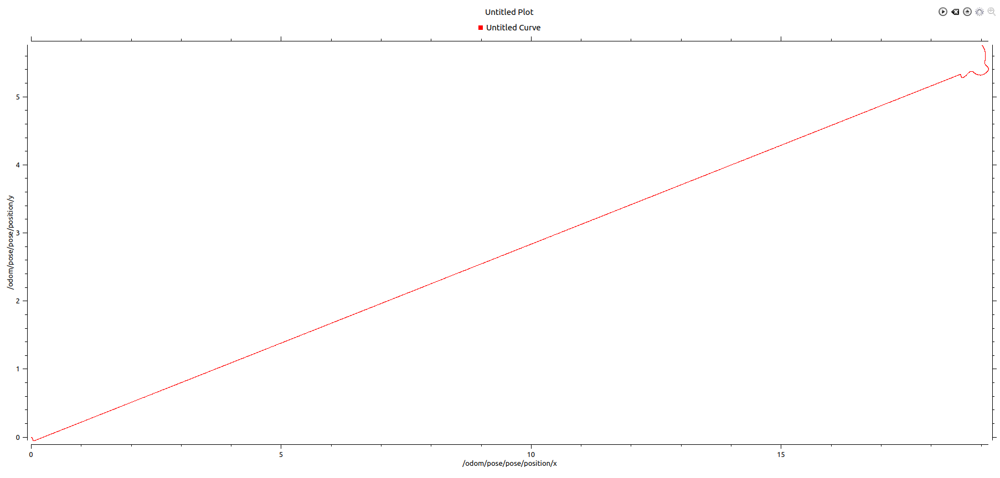

# Week 4 shit

1. Had to install robot_localization package. 

Node \[/ekf_localization\]
Publications: 
 * /diagnostics \[diagnostic_msgs/DiagnosticArray\]
 * /odometry/filtered \[nav_msgs/Odometry\]
 * /rosout \[rosgraph_msgs/Log\]
 * /tf \[tf2_msgs/TFMessage\]

Subscriptions: 
 * /clock \[rosgraph_msgs/Clock\]
 * /imu/data \[unknown type\]
 * /set_pose \[unknown type\]
 * /tf \[tf2_msgs/TFMessage\]
 * /tf_static \[tf2_msgs/TFMessage\]

Services: 
 * /ekf_localization/enable
 * /ekf_localization/get_loggers
 * /ekf_localization/set_logger_level
 * /ekf_localization/toggle
 * /set_pose

2. /odom works but /odometry/filtered doesnt - 

WARNING: no messages received and simulated time is active.
Is /clock being published?

### Using /odom

3. 

path:        smb_navigation.bag

version:     2.0

duration:    59.7s

start:       Feb 02 2017 19:05:46.09 (1486033546.09)

end:         Feb 02 2017 19:06:45.82 (1486033605.82)

size:        158.9 MB

messages:    1545

compression: none \[191/191 chunks/]

types:       

nav_msgs/Odometry       \[cd5e73d190d741a2f92e81eda573aca7/]

sensor_msgs/Imu         \[6a62c6daae103f4ff57a132d6f95cec2/]

sensor_msgs/JointState  \[3066dcd76a6cfaef579bd0f34173e9fd/]

sensor_msgs/PointCloud2 \[1158d486dd51d683ce2f1be655c3c181/]

topics:      

/imu/data                       578 msgs    : sensor_msgs/Imu       
 
/joint_states                   280 msgs    : sensor_msgs/JointState 

/rslidar_points                 381 msgs    : sensor_msgs/PointCloud2
             
/smb_velocity_controller/odom   306 msgs    : nav_msgs/Odometry

4. 

- roscore
- roslaunch smb_localization smb_localization.launch
- rosbag play smb_navigation.bag --clock